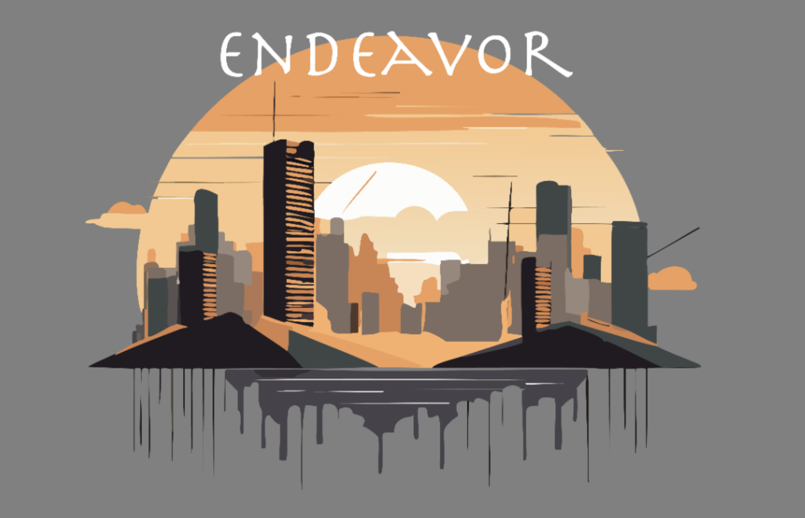
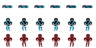
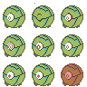
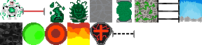

<div align="center">

<a href="https://drive.google.com/file/d/1q1sXsksfKmtApsG6ENf4zzJCNCSaaJip/view?usp=sharing" target="_blank" rel="noopener noreferrer">
        
</a>

# Endeavor

*A fast-paced retro sci‑fi platformer about momentum, precision, and overcoming escalating arenas.*

<br/>
<strong>Trailer:</strong> <a href="https://drive.google.com/file/d/1q1sXsksfKmtApsG6ENf4zzJCNCSaaJip/view?usp=sharing">Watch on Google Drive</a>

</div>

## Overview
Endeavor is a 2D action platformer built in C# atop a lightweight custom SDL2-based engine. Dash across treacherous platforms, outmaneuver adaptive enemies, and survive multi-phase boss encounters while unlocking stat improvements and discovering environmental shortcuts. Designed with an emphasis on readable mechanics and responsive feel, Endeavor blends arcade pacing with deliberate movement physics.

## Core Pillars
- **Weighty Movement:** Friction, acceleration, ladders, moving & disappearing platforms, boosters, portals.
- **Combat Rhythm:** Projectile timing, enemy tells, armor durability, temporary boosts, laser hazard cycles.
- **Progress Feedback:** Persistent statistics (kills, jumps, shots, deaths) surfaced via the scoreboard screen.
- **Layered Presentation:** Parallax backgrounds & screen-state overlays (start, win/lose, credits, statistics).

## Features
- Multi-level progression with discrete difficulty curves (tutorial + 3 core stages + boss arena).
- Boss encounter with health phase feedback & projectile pattern pressure.
- Collectible boosters (speed / float mechanic) and armor with durability tracking.
- Laser & environmental hazard timing cycles for route planning.
- Portals enabling spatial shortcuts & encounter resets.
- Persistent stat tracking stored in `Assets/GameStats.txt` (auto-read on scoreboard view).
- Screen system (start, controls, credits, win, boss win, lose, scoreboard) using static visibility flags.

## Screens & Flow
```text
Start → (Play | Controls | Credits | Statistics)
        Play → Level N (1..4) → Win → Next Level
        Play → Death → Lose Screen → Respawn Same Level
        Play (Boss) → BossWin Screen → Reset to Start
```

## Gameplay Loop
1. Enter a level & assess hazards.
2. Navigate platforms (momentum + jump shaping) & engage enemies.
3. Collect armor / boosters for temporary advantages.
4. Reach win block or defeat boss.
5. View transitional win / lose feedback, update persistent stats.

## Controls
| Action      | Keys / Input                |
|-------------|-----------------------------|
| Move        | `A` / `D` or ← / →          |
| Jump        | `W` or ↑                    |
| Shoot       | Left Mouse Button           |
| Ladder Up   | `W` or ↑                    |
| Ladder Down | `S` or ↓                    |
| Float Toggle (Boost) | `F` (when boosted) |

## Tech Stack
- **Language:** C# (.NET 10 target framework)
- **Rendering/Input/Audio:** SDL2 bindings
- **Project Layout:** Custom minimal engine (`Engine/`) + game logic (`Game/`)
- **Assets:** Raw PNG sprite sheets, TTF fonts, WAV/OGG sound effects

## Directory Structure (Simplified)
```
Assets/                Art, fonts, audio, level & stat data
src/Engine/            Core engine (input, drawing, audio wrappers)
src/Game/              Entities, Player, Boss, Screens, Level logic
src/Game.csproj        Project file & build settings
Builds/                Output binaries (Debug/Release per TFMs)
```

## Build & Run
### Prerequisites
- [.NET SDK](https://dotnet.microsoft.com/download)

### Clone
```sh
git clone https://github.com/Williamzhibo/Endeavor.git
cd Endeavor
```

### Run (Debug)
```sh
dotnet run --project src/Game.csproj
```

### Multi-Target Build Artifacts
The solution builds for multiple target frameworks (e.g. `net10.0`, legacy). Output under `src/Builds/Debug/<tfm>/`.

## Persistent Statistics
The scoreboard reads & writes cumulative totals to `Assets/GameStats.txt` using `ScoreboardHelper`. Deleting the file resets progression metrics.

## Selected Systems
| System          | File(s)                            | Notes |
|-----------------|------------------------------------|-------|
| Player Control  | `Player.cs`                        | Jump shaping & booster float mechanic |
| Boss Logic      | `Boss.cs`, `EnemyBullet.cs`        | Health phasing & projectile bursts |
| Screens         | `Screens.cs`                       | Static visibility flags per screen |
| Entities / World| `Entities.cs`                      | Platforms, hazards, portals, boosters |
| Stats & UI      | `ScoreboardHelper.cs`, `PlayerStats.cs` | Persistent + HUD rendering |
| Camera          | `Camera.cs` (if present)           | In‑camera culling checks |

## Visuals
<div align="center">



<br/>
<em>Core sprite assets (player, boss, environment sheet)</em>
</div>

## Roadmap
- Additional enemy archetypes (ranged tracker, area denial).
- Expanded booster set (shield pulse, temporal slow).
- Level editor ingestion (external JSON layout).
- Accessibility options (colorblind palette & key remap).
- Steam / itch.io packaging scripts.

## Contributing
Issues & PRs are welcome. Please open an issue describing proposed changes before large refactors. Keep engine layer minimal and avoid asset bloat.

## License
MIT — see [LICENSE.md](LICENSE.md).

## Attribution & Credits
- Programming / Design: Contributors listed in Credits screen.
- Fonts: `Retro Gaming.ttf`, `Archeologicaps.ttf` (see individual font licenses if redistributed).
- All custom art & audio provided for this project only; please request permission before reuse.

---
> Built with care by a small indie team exploring responsive 2D platforming. Enjoy the journey!
